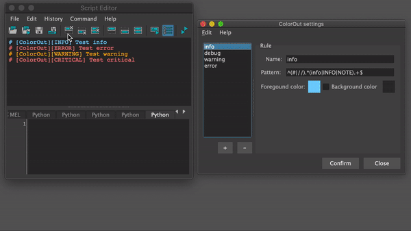

# ColorOut

## Maya stdout syntax highlight



## Features

- Highlight console output based on user's regex rules
- Settings dialog for adding/editing rules (Located under Windows menu>ColorOut. *After new scene is opened*)

## Installation

 1. Clone/download repo to anywhere on your machine
 2. Create **ColorOut.mod** in *documents/maya/modules*
 3. Add the following lines to it:

```python
+ ColorOut 1.0.0 YourPathHere/ColorOut
scripts: YourPathHere/ColorOut
```
